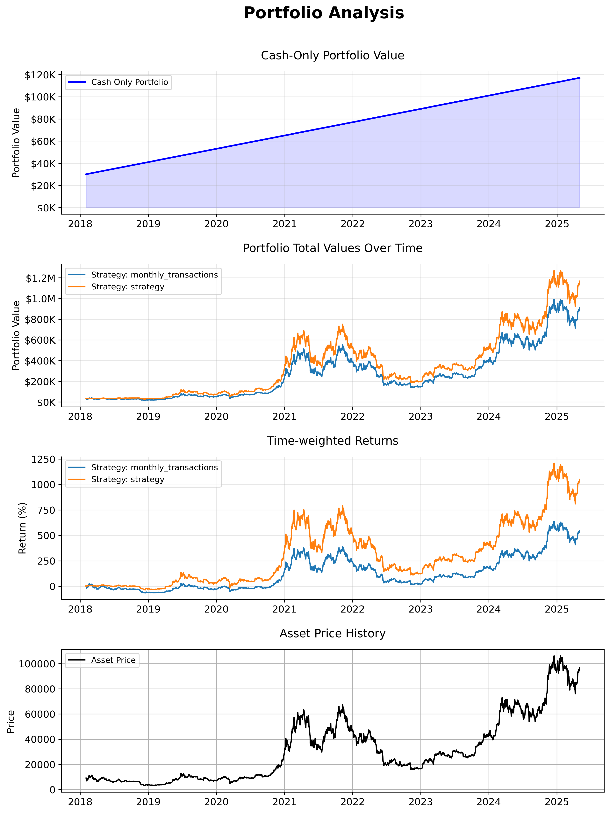

# Portfolio Analysis Report
Generated on 2025-05-17 19:33:16

## Performance Metrics

### Strategy Performance Summary

### Strategy: monthly_transactions
- Total Cash Contributions: $118,000.00
- Final Total Assets: $910,403.87
- Money-weighted Return: 64.11%
- Sharpe Ratio: 0.57
- Time-weighted CAGR: 59.37%
- Maximum Drawdown: 75.32%

### Strategy: strategy
- Total Cash Contributions: $118,000.00
- Final Total Assets: $1,167,885.01
- Money-weighted Return: 71.56%
- Sharpe Ratio: 0.68
- Time-weighted CAGR: 64.94%
- Maximum Drawdown: 75.45%

## Portfolio Analysis Charts

